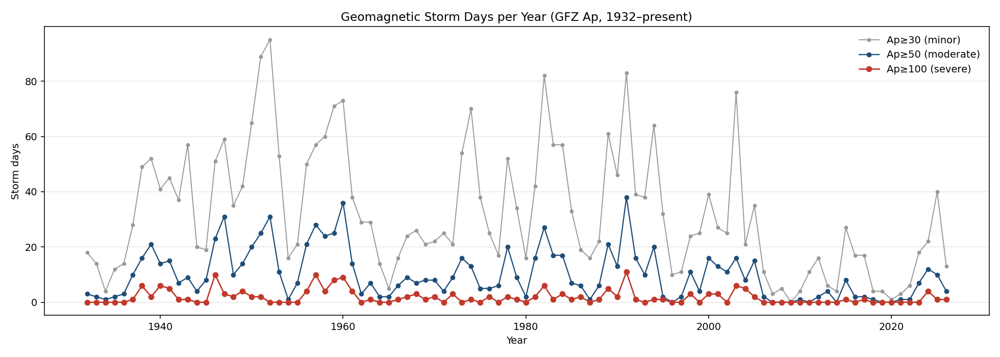
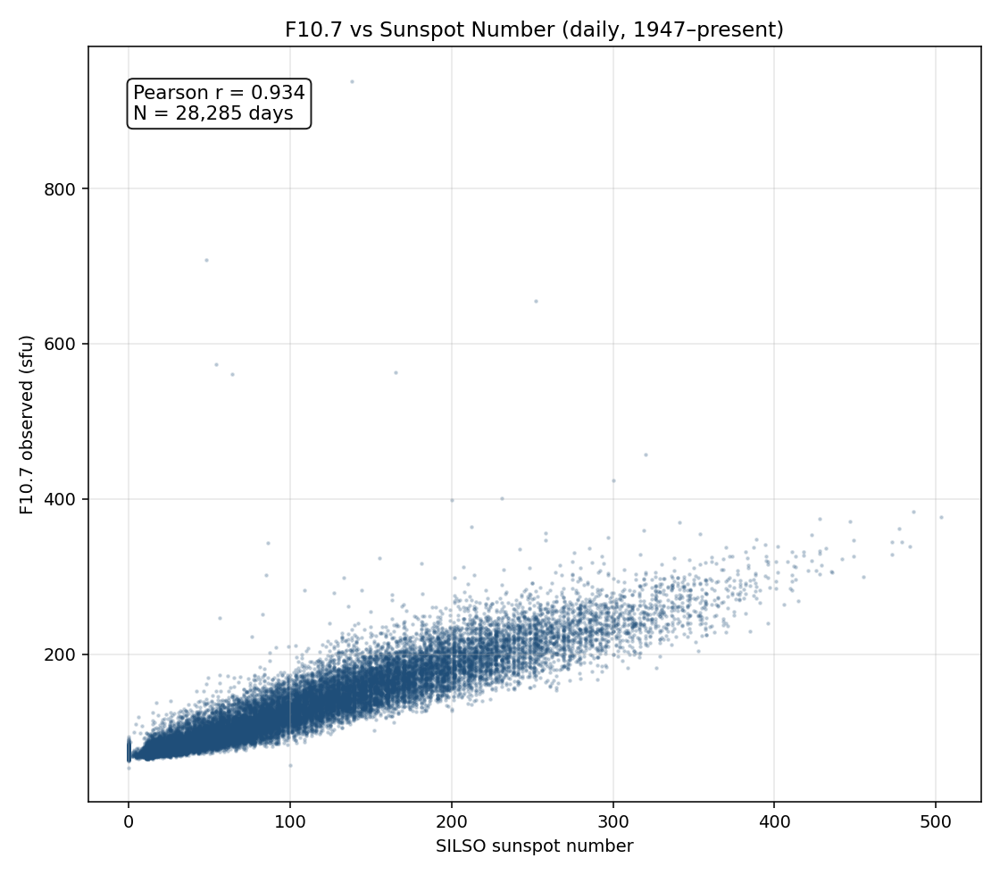

# Space Weather

Pull two long-running space weather records into a local SQLite database, then explore them in a Jupyter notebook.

## What it does

`fetch_spaceweather.py` downloads two plain-text catalogs from the agencies that produce them:

- **SILSO daily sunspot numbers** (Royal Observatory of Belgium, v2.0 series): daily total sunspot number, 1818-01-01 → today.
- **GFZ Potsdam Kp/ap/Ap + SN + F10.7** (Helmholtz Centre, Niemegk Observatory): three-hourly Kp values, daily Ap, international sunspot number, and 10.7 cm radio flux, 1932-01-01 → today.

Results land in `spaceweather.sqlite` (~10 MB total). The fetcher is idempotent on the date key — re-running just refreshes the most recent (preliminary) values.

`spaceweather.ipynb` reads the database and produces the five plots below. Each is also written to `figures/` so you can browse them on GitHub without running the notebook.

## Sample output

### Sunspot number, 1818–present


### Yearly mean


### Solar cycle peak amplitudes

Cycle 24 (red) is the smallest cycle since Cycle 14 (1902–13). Whether that signals the start of a new grand minimum or a normal trough between the bigger Modern Maximum (Cycles 17–22) and whatever comes next was an active debate when Cycle 25 was forecast — and Cycle 25 came in stronger than the consensus prediction, so the "new Maunder" narrative has weakened since 2023.


### Geomagnetic storm days per year (the detection-bias control)



### F10.7 vs sunspot number (the cross-validation)

F10.7 cm radio flux is measured by a single instrument, isn't subject to visual-observer bias, and tracks the same underlying solar activity as the sunspot count. Daily Pearson r ≈ 0.93 since 1947 — the v2.0 sunspot series and the radio flux are measuring the same Sun.



## Why these specific cutoffs

Space weather datasets have at least three different "detection floors" baked into them, and naïvely concatenating decades of data without acknowledging those floors produces apparent trends that are really about the network, not the Sun.

**Why SILSO starts in 1818, not 1700.** Wolf's reconstructed monthly sunspot numbers go back to 1749 and yearly numbers to 1700, but the daily series begins in 1818 because that's roughly when daily observation by multiple stations became consistent enough to compute a daily total at all. Even after 1818, the pre-1849 daily data is sparse — many days have no observation (`-1` in the catalog) because the global observer network was still being assembled. The plots in this repo filter out those `-1` days, but you can see the gappiness directly: of 76,091 days in the catalog, 72,844 actually have an observation; the missing 3,247 are concentrated almost entirely before 1849.

**Why "v2.0" matters.** Until 2015, the official sunspot number was the Wolf series (called Ri or SSN), with a stable definition since the 1860s. In 2015, after a multi-year recalibration project led by Clette, Lefèvre, and Vaquero, SILSO published version 2.0 — a complete revision of the daily series back to 1818. The big changes:

- The 1947 calibration jump from observer Wolfer to Brunner was removed (this single fix raised post-1947 numbers by ~20%).
- The Waldmeier weighting (used 1945–1980) was reverted to a simple count, lowering some peaks.
- Pre-1849 numbers were tied more carefully to Hoyt & Schatten's group sunspot data.

The net effect: every cycle peak in this repo's plots is a v2.0 number. If you compare these to a textbook from before 2015, the numbers will be ~20% different. That's the recalibration, not the Sun. The "Cycle 24 is unusually weak" headlines from 2014 looked weaker still in v1 numbers; v2.0 raised the modern numbers more than the historical ones, partially closing the gap.

**Why GFZ starts in 1932.** The Bartels Kp index was defined in 1932 and has been computed continuously since, using a network of 13 magnetometer observatories at mid-latitudes that's stayed broadly stable for ~90 years. Storm-day counts on the Ap index are the cleanest available "is the Sun-Earth coupling getting more energetic?" signal: the magnetic field doesn't care who's counting sunspots, and the calibration of the network has been preserved across instrument generations specifically because Kp is operational (used for radio propagation forecasts and satellite operations). It's the closest analog to "M≥7 earthquakes" in the seismic catalog — a band where the detection floor was reached before the time series begins, so trends in storm-day counts reflect real heliospheric activity rather than improving instruments.

**Why F10.7 starts in 1947.** The Penticton (BC) radio observatory has measured the 10.7 cm solar flux daily since 1947. Single instrument, single location, single calibration chain — it's the cross-check that lets you ask "is the recalibrated sunspot series consistent with the independent radio measurement?" The answer in this repo is yes (r ≈ 0.93 daily, even higher monthly), which is what justifies treating v2.0 as the reference series.

**What's the M≥7 equivalent.** For seismic data the natural detection-floor-free band is M≥7 — those events register globally regardless of network density. For space weather there's no single equivalent, but the closest is **Ap ≥ 100 storm days**: a severe storm is large enough to be unambiguously detected by *any* mid-latitude magnetometer, and the count per year hasn't been distorted by network expansion since 1932. The plot above shows ~5–10 such days in active years and near-zero in quiet years, tracking the solar cycle cleanly with no secular trend.

## Setup

```bash
python3 -m venv venv
source venv/bin/activate
pip install -r requirements.txt
```

## Fetch the data

```bash
python fetch_spaceweather.py
```

Defaults pull both catalogs in full (they're small — SILSO is ~3 MB, GFZ is ~5 MB). Use `--skip-silso` or `--skip-gfz` to refresh only one.

## Open the notebook

```bash
jupyter notebook spaceweather.ipynb
```

Re-executing the notebook refreshes the PNGs in `figures/` as a side effect.

## Data citations

- SILSO: SILSO World Data Center (1818–present). *International Sunspot Number Monthly Bulletin and online catalogue.* Royal Observatory of Belgium. https://www.sidc.be/SILSO/ (CC BY-NC 4.0)
- Kp/ap/Ap: Matzka, J., Bronkalla, O., Tornow, K., Elger, K., Stolle, C. (2021). *Geomagnetic Kp index.* GFZ Helmholtz Centre. https://doi.org/10.5880/Kp.0001 (CC BY 4.0)
- F10.7: Tapping, K. F. (2013). *The 10.7 cm solar radio flux (F10.7).* Space Weather, 11, 394–406. https://doi.org/10.1002/swe.20064
