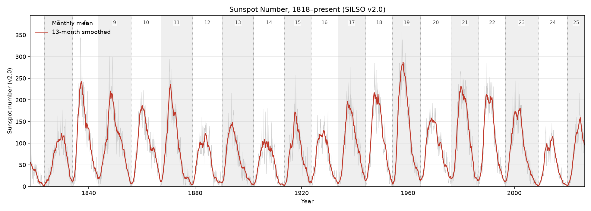
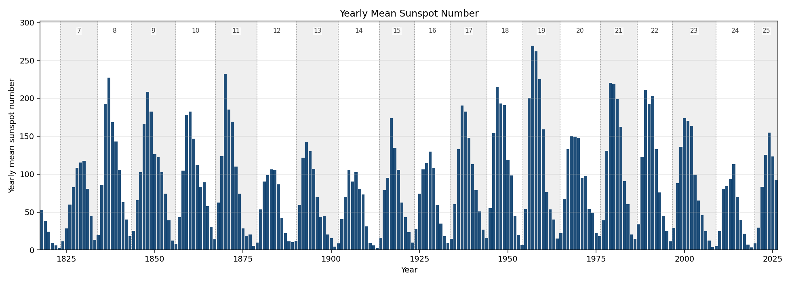
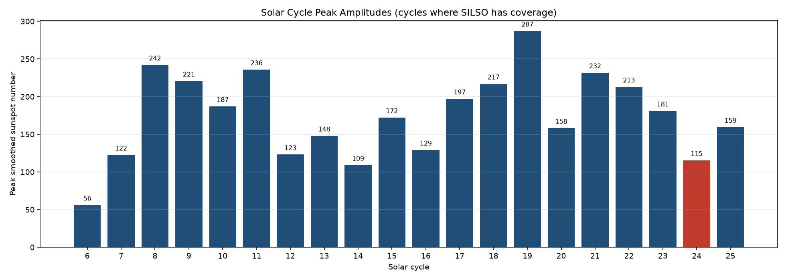
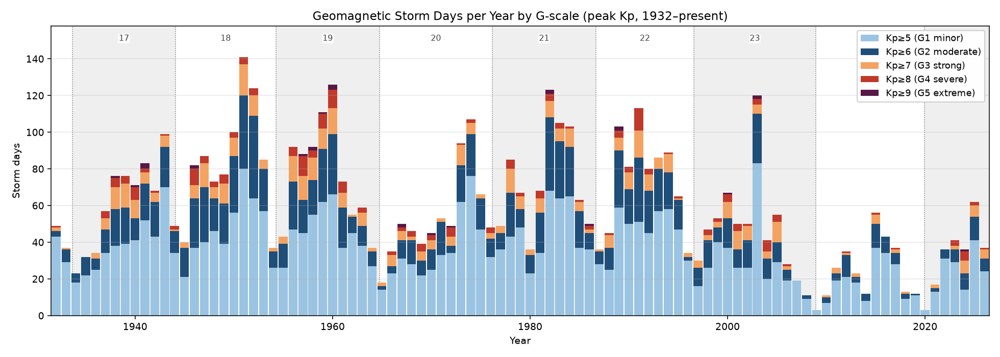
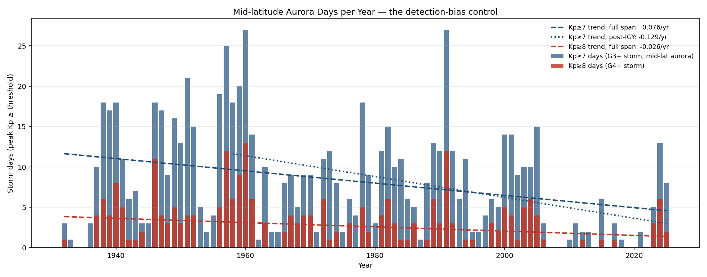
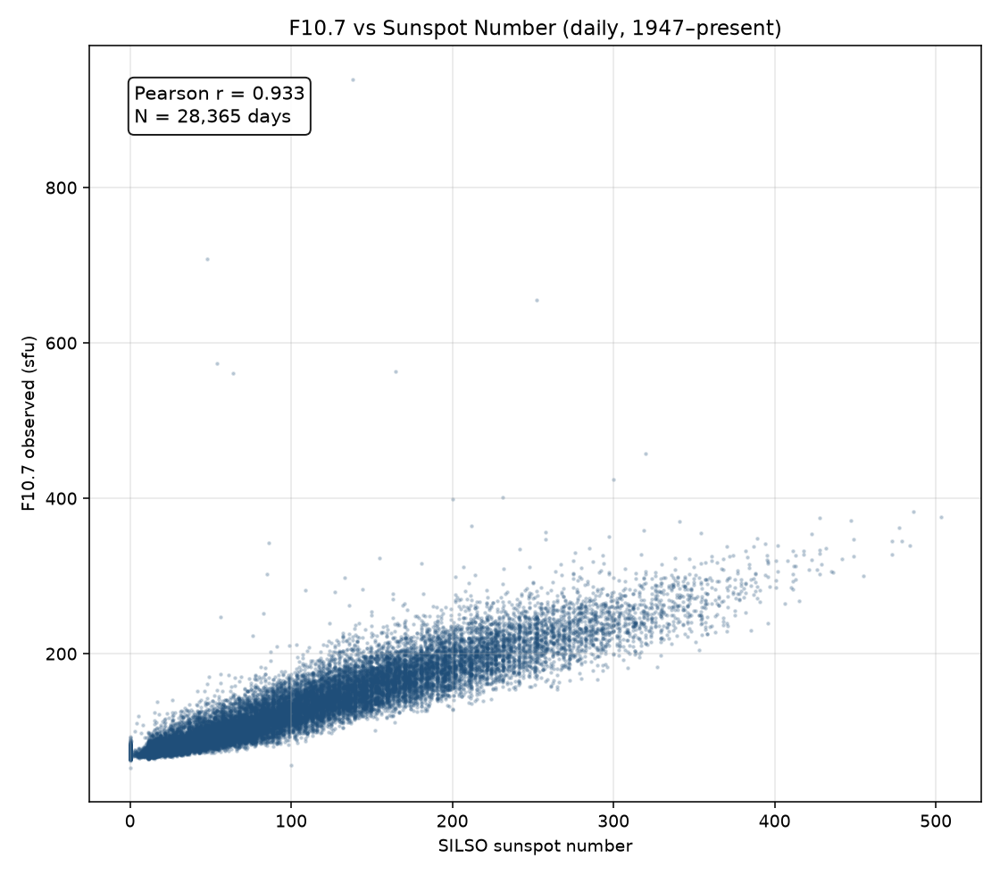

# Space Weather

Pull two long-running space weather records into a local SQLite database, then explore them in a Jupyter notebook. One of 10 sibling repos analyzed together — see the [`correlations`](https://github.com/Biblejustin/correlations) hub for the cross-repo analysis.

## What it does

`fetch_spaceweather.py` downloads two plain-text catalogs from the agencies that produce them:

- **SILSO daily sunspot numbers** (Royal Observatory of Belgium, v2.0 series): daily total sunspot number, 1818-01-01 → today.
- **GFZ Potsdam Kp/ap/Ap + SN + F10.7** (Helmholtz Centre, Niemegk Observatory): three-hourly Kp values, daily Ap, international sunspot number, and 10.7 cm radio flux, 1932-01-01 → today.

Results land in `spaceweather.sqlite` (~10 MB total). The fetcher is idempotent on the date key — re-running just refreshes the most recent (preliminary) values.

`spaceweather.ipynb` reads the database and produces the six plots below. Each is also written to `figures/` so you can browse them on GitHub without running the notebook.

## Sample output

### Sunspot number, 1818–present



### Yearly mean



### Solar cycle peak amplitudes

Cycle 24 (red) is the smallest cycle since Cycle 14 (1902–13). Whether that signals the start of a new grand minimum or a normal trough between the bigger Modern Maximum (Cycles 17–22) and whatever comes next was an active debate when Cycle 25 was forecast — and Cycle 25 came in stronger than the consensus prediction, so the "new Maunder" narrative has weakened since 2023.

**Above vs. below the average:** Bars *above* the long-run mean peak are above-average cycles (Cycles 17–22, the Modern Maximum); bars *below* the mean are below-average (Cycles 14 and 24, plus the pre-Modern-Maximum cycles). Cycle 25 is still in progress so its bar will keep growing until its maximum is reached.



### Geomagnetic storm days per year by G-scale

A "storm day" here means at least one three-hour interval that day reached the given peak Kp. NOAA's G-scale maps directly: G1 minor = Kp 5, G2 moderate = Kp 6, G3 strong = Kp 7, G4 severe = Kp 8, G5 extreme = Kp 9. Using peak Kp rather than daily-mean Ap matters: a storm that peaks at Kp 8 for three hours and then settles to Kp 3 has its daily Ap diluted by quiet hours, but it still produced a G4 event with mid-latitude aurora.

**Above vs. below the 11-year-cycle baseline:** The stacked bars naturally follow the ~11-year solar cycle, with peaks during solar max and troughs during solar min. A year whose bar exceeds the typical solar-max peak (~30–50 G1+ days) was unusually active for its cycle phase; a year well below typical solar-min levels (~5 G1+ days) was unusually quiet. The 1989 and 2003 spikes are above-cycle outliers (the March 1989 Quebec storm and Halloween 2003 sequence).



### Mid-latitude aurora days (Kp ≥ 7) — the detection-bias control

The closest space-weather analog to the M ≥ 7 earthquake control. A peak Kp of 7 is the threshold where the auroral oval expands far enough south that aurora becomes visible from roughly 45° geomagnetic latitude — northern Illinois, Oregon, central Europe — i.e., from places where it makes the news rather than going unremarked. At Kp 8 (G4) it reaches Tennessee and Virginia; at Kp 9 (G5), the famous historical low-latitude events (Carrington 1859 — Hawaii, Cuba; March 1989 — Texas; Halloween 2003 — Florida; May 2024 — Mexico).

A G3+ storm is large enough to be detected unambiguously by *any* mid-latitude magnetometer, and the Kp network has been operating with the same methodology since 1932. So the year-over-year count reflects real heliospheric activity, not detection-floor improvements. Two trend lines:

- **Full span** (1932–today, 94 years): −0.076 days/year
- **Post-IGY** (1958–today, 68 years): −0.129 days/year

Both spans show a slight decline. The post-IGY slope being *steeper* than the full-span slope is itself diagnostic: if detection had been improving over time, we'd expect more recent years to register more storms, biasing the slope *positive*. The slopes go the other way, which means whatever's happening is opposite to a detection artifact. The decline is real, and it's about the Sun — specifically the Modern Maximum (Cycles 17–22, roughly 1933–2008) being unusually active and the last two cycles being unusually quiet. Cycle 25 (now active) has already produced one G5 event (May 2024).

**Above vs. below the trend lines:** A year's bar *above* either trend line had more Kp≥7 days than the corresponding average; *below* the line had fewer. The 1960 and 1991 bars rise highest (Cycle 19 and Cycle 22 peaks, both well above any of the trend lines). The mid-2000s and 2010s bars often sit *below* both trend lines, which is the visible signature of the post-2008 solar slowdown that drives the negative slopes.



### F10.7 vs sunspot number (the cross-validation)

F10.7 cm radio flux is measured by a single instrument, isn't subject to visual-observer bias, and tracks the same underlying solar activity as the sunspot count. Daily Pearson r ≈ 0.93 since 1947 — the v2.0 sunspot series and the radio flux are measuring the same Sun.

**Above vs. below the regression line:** Dots *above* the best-fit line are days when F10.7 was higher than the sunspot number alone would predict; dots *below* are days when F10.7 was lower than the sunspot count would predict. The tightness of the cloud around the line is the cross-validation — a tight cloud (which is what we see, r=0.93) means the two independent measurements of solar activity agree very well. Big residuals (dots far from the line in either direction) tend to fall on days with active-region complexity that drives radio emission differently from visible spot count — i.e., they're a feature, not a bug.



## Why these specific cutoffs

Space weather datasets have at least three different "detection floors" baked into them, and naïvely concatenating decades of data without acknowledging those floors produces apparent trends that are really about the network, not the Sun.

**Why SILSO starts in 1818, not 1700.** Wolf's reconstructed monthly sunspot numbers go back to 1749 and yearly numbers to 1700, but the daily series begins in 1818 because that's roughly when daily observation by multiple stations became consistent enough to compute a daily total at all. Even after 1818, the pre-1849 daily data is sparse — many days have no observation (`-1` in the catalog) because the global observer network was still being assembled. The plots in this repo filter out those `-1` days, but you can see the gappiness directly: of 76,091 days in the catalog, 72,844 actually have an observation; the missing 3,247 are concentrated almost entirely before 1849.

**Why "v2.0" matters.** Until 2015, the official sunspot number was the Wolf series (called Ri or SSN), with a stable definition since the 1860s. In 2015, after a multi-year recalibration project led by Clette, Lefèvre, and Vaquero, SILSO published version 2.0 — a complete revision of the daily series back to 1818. The big changes:

- The 1947 calibration jump from observer Wolfer to Brunner was removed (this single fix raised post-1947 numbers by ~20%).
- The Waldmeier weighting (used 1945–1980) was reverted to a simple count, lowering some peaks.
- Pre-1849 numbers were tied more carefully to Hoyt & Schatten's group sunspot data.

The net effect: every cycle peak in this repo's plots is a v2.0 number. If you compare these to a textbook from before 2015, the numbers will be ~20% different. That's the recalibration, not the Sun. The "Cycle 24 is unusually weak" headlines from 2014 looked weaker still in v1 numbers; v2.0 raised the modern numbers more than the historical ones, partially closing the gap.

**Why GFZ starts in 1932.** The Bartels Kp index was defined in 1932 and has been computed continuously since, using a network of 13 magnetometer observatories at mid-latitudes that's stayed broadly stable for ~90 years. Storm-day counts on the Ap index are the cleanest available "is the Sun-Earth coupling getting more energetic?" signal: the magnetic field doesn't care who's counting sunspots, and the calibration of the network has been preserved across instrument generations specifically because Kp is operational (used for radio propagation forecasts and satellite operations). It's the closest analog to "M≥7 earthquakes" in the seismic catalog — a band where the detection floor was reached before the time series begins, so trends in storm-day counts reflect real heliospheric activity rather than improving instruments.

**Why F10.7 starts in 1947.** The Penticton (BC) radio observatory has measured the 10.7 cm solar flux daily since 1947. Single instrument, single location, single calibration chain — it's the cross-check that lets you ask "is the recalibrated sunspot series consistent with the independent radio measurement?" The answer in this repo is yes (r ≈ 0.93 daily, even higher monthly), which is what justifies treating v2.0 as the reference series.

**What's the M≥7 equivalent.** For seismic data the natural detection-floor-free band is M≥7 — those events register globally regardless of network density. For space weather the closest equivalent is **peak Kp ≥ 7 days** (G3 strong storm or worse). The threshold is physically motivated rather than arbitrary: at Kp ≥ 7 the auroral oval expands far enough south to produce aurora visible from ~45° geomagnetic latitude (northern US, central Europe), and a storm of that size disturbs *every* mid-latitude magnetometer in the network — its detection doesn't depend on instrument sensitivity. Counted from peak Kp during the day rather than daily-mean Ap (a Kp 8 spike for one 3-hour window is a G4 event even if the rest of the day was quiet, and that's what determines aurora visibility). The plot above shows the count averages ~8 days/year, peaking at 27 in 1960 (Cycle 19) and 1991 (Cycle 22), and the trend is slightly negative — but the slope going *more* negative on the shorter post-IGY span argues against a detection-improvement explanation, since detection improvements would push the slope positive. The signal is solar: the Modern Maximum (Cycles 17–22) was unusually active, and the last two cycles have been unusually quiet.

## Setup

```bash
python3 -m venv venv
source venv/bin/activate
pip install -r requirements.txt
```

## Fetch the data

```bash
python fetch_spaceweather.py
```

Defaults pull both catalogs in full (they're small — SILSO is ~3 MB, GFZ is ~5 MB). Use `--skip-silso` or `--skip-gfz` to refresh only one.

## Open the notebook

```bash
jupyter notebook spaceweather.ipynb
```

Re-executing the notebook refreshes the PNGs in `figures/` as a side effect.

## Data citations

- SILSO: SILSO World Data Center (1818–present). *International Sunspot Number Monthly Bulletin and online catalogue.* Royal Observatory of Belgium. https://www.sidc.be/SILSO/ (CC BY-NC 4.0)
- Kp/ap/Ap: Matzka, J., Bronkalla, O., Tornow, K., Elger, K., Stolle, C. (2021). *Geomagnetic Kp index.* GFZ Helmholtz Centre. https://doi.org/10.5880/Kp.0001 (CC BY 4.0)
- F10.7: Tapping, K. F. (2013). *The 10.7 cm solar radio flux (F10.7).* Space Weather, 11, 394–406. https://doi.org/10.1002/swe.20064
